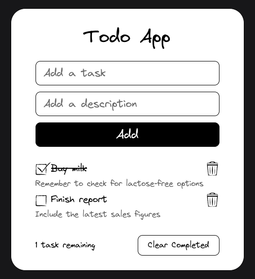

# Technical Test: React Todo List Application (Basic)

## Description

This is a basic technical test designed to assess a developer's skills in React. The goal is to create a todo list application with basic functionalities such as viewing, adding, marking as completed, and deleting tasks.

## Difficulty Level

Basic

## Features

### View Tasks

- Display a list of tasks.
- Each task should have a title and optionally a description.
- Show a placeholder in case there are no tasks.

### Add New Tasks

- A form to enter the title and description of the new task.
- A button to add the task to the list.

### Mark Tasks as Completed

- Option to mark a task as completed (e.g., using a checkbox).
- Completed tasks may be displayed differently (e.g., with strikethrough text).

### Delete Tasks

- Button to delete individual tasks from the list.

### Delete Completed Tasks

- Functionality to remove completed tasks from the list and storage.

### Data Persistence

- Save tasks in local storage.

### Validations

- Do not allow the user to create a todo without a title.
- Handle errors.
- Do not show the button to clear completed tasks if the condition is not met.

### Styles and Responsiveness

- Basic design.

## Technical Structure

### Components

- A component for the add tasks form.
- A component to display each task.
- A component for the task list, which uses the individual task component.

### State and Data Handling

- Use `useState` to handle the state of the task list.
- Use `useEffect` to load/save tasks from local storage.

### Event Handling

- Functions to handle the addition, deletion, and marking of tasks as completed.

### Styles

- Use Vanilla CSS or CSS Modules.

### Wireframe

  

