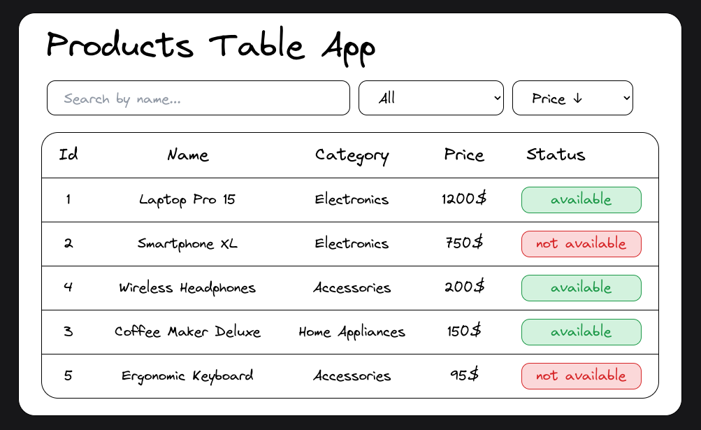

# Technical Test: React Product List Application (Basic)

## Description

Develop a React application that visualizes data from a provided JSON file. The application should allow the user to interact with the data in various ways.

## Difficulty Level

Basic

## Features

### Data Loading and Display:

- Load data from the provided JSON file.
- Display a list of products in a table.

### Product Search:

- A text field to search for products by name.

### Product Filtering:

- A select dropdown to filter products by availability (available or not available).

### Product Sorting:

- A select dropdown to sort products by name or price (ascending).

## Technical Structure

### Initial Setup:

- Create a React application using [Vite](https://vitejs.dev/).

### Styles

- Use Vanilla CSS / Modules or Tailwind CSS.

### Wireframe

  

