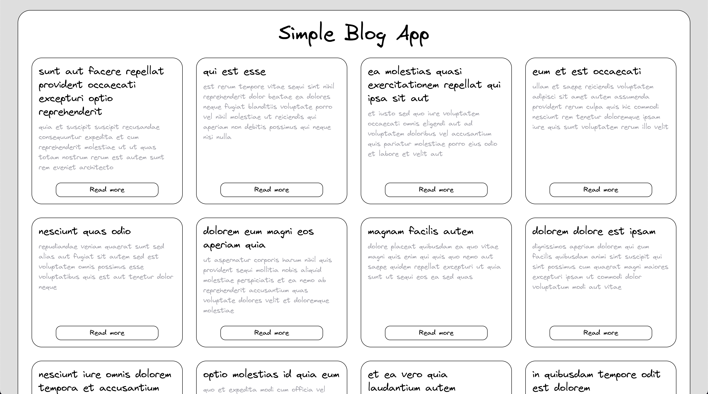
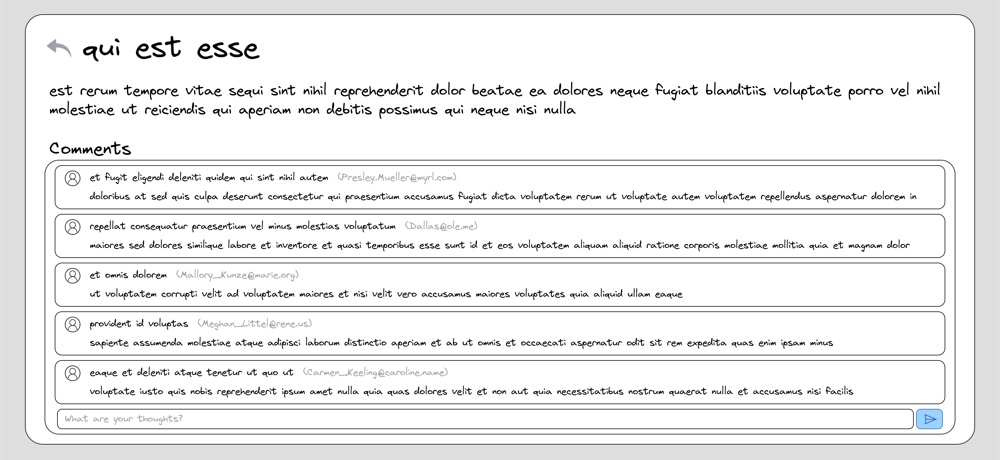

# Technical Test: Simple Blog Application (Basic / Intermediate)

This application is a technical test designed to assess React skills. It consists of a simplified blog application that allows users to view a list of posts and access their detailed content.

## Difficulty Level

Basic / Intermediate

## User Stories

1. **View Posts:** As a user, I want to see a list of posts so I can choose which one to read.
2. **Post Details:** As a user, I want to be able to click on a post to read its full content.
3. **Add Comments:** As a user, I want to be able to leave comments on posts to express my opinions or ask questions.

## Engineer Stories

1. **Create Posts List Component:** As an engineer, I need to design a component that displays all available posts.
2. **Implement Navigation:** As an engineer, I should implement navigation between the list of posts and their details using React Router.
3. **Manage Comments:** As an engineer, I need to implement a way for users to add and view comments on each post.
4. **Custom Hooks:** As an engineer, I should use custom hooks to encapsulate business logic and keep components as simple as possible.
5. **Apply Styles:** As an engineer, I must apply CSS styles to enhance the user experience. The use of any CSS library or framework is allowed according to the developer's preference.

## Technology Stack

- [React](https://reactjs.org/)
- [React Router](https://reactrouter.com/)

## Code Requirements

The following tools must be used to ensure code quality and consistency:

- **ESLint:** To ensure consistent coding style and prevent common errors. It should be configured following the best standard practices of the React community.
- **Prettier:** To automatically format the code. All project files are expected to be formatted using Prettier.

These tools help maintain a high standard of code quality and are essential for teamwork and project scalability.

## Integration with REST API

This application consumes data from a REST API to retrieve posts and comments. The API used is `jsonplaceholder` and can be found [here](https://jsonplaceholder.typicode.com/).

Note: Be sure to review the API documentation to fully understand how to interact with it.

### Wireframe

  
  

